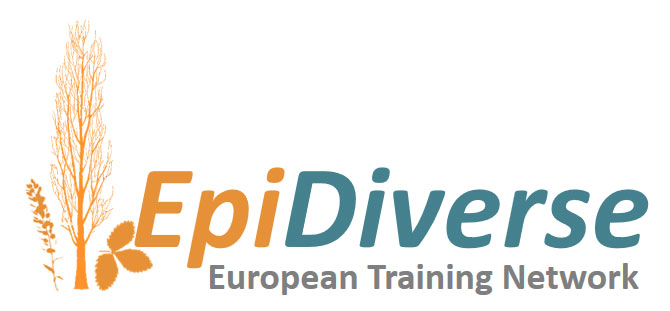

[](https://ec.europa.eu/programmes/horizon2020/en)
[](https://epidiverse.eu)

EpiDiverse-DMR Pipeline
========================

[](https://www.nextflow.io/)
[](http://bioconda.github.io/)
[](https://hub.docker.com/r/epidiverse/dmr)
[](https://github.com/EpiDiverse/dmr/releases/latest)
[](https://academic.oup.com/bioinformatics/article-abstract/36/11/3314/5809142)
[](https://twitter.com/intent/follow?screen_name=epidiverse)

**EpiDiverse/dmr** is a bioinformatics analysis pipeline for calling differentially methylated positions or regions from non-model plant species.

The workflow processes raw methylation data from bedGraphs resulting from the [EpiDiverse/wgbs](https://github.com/epidiverse/wgbs/) pipeline, which are then grouped for analysis with [bedtools unionbedg](https://github.com/arq5x/bedtools2). Each pairwise comparison between groups is performed with [metilene](https://www.bioinf.uni-leipzig.de/Software/metilene/), and downstream visualisation is carried out with R-packages [ggplot2]() and [gplots]() to produce distribution plots and heatmaps.

> See the [output documentation](docs/output.md) for more details of the results.

The pipeline is built using [Nextflow](https://www.nextflow.io), a workflow tool to run tasks across multiple compute infrastructures in a very portable manner. It comes with docker containers making installation trivial and results highly reproducible.

## Quick Start

1. Install [`nextflow`](https://www.nextflow.io/)

2. Install one of [`docker`](https://docs.docker.com/engine/installation/), [`singularity`](https://www.sylabs.io/guides/3.0/user-guide/) or [`conda`](https://conda.io/miniconda.html)

3. Download the pipeline and test it on a minimal dataset with a single command

```bash
NXF_VER=20.07.1 nextflow run epidiverse/dmr -profile test,<docker|singularity|conda>
```

4. Start running your own analysis!

```bash
NXF_VER=20.07.1 nextflow run epidiverse/dmr -profile <docker|singularity|conda> \
--input /path/to/wgbs/bam --samples /path/to/samples.tsv
```

> See the [usage documentation](docs/usage.md) for all of the available options when running the pipeline.

### Wiki Documentation

The EpiDiverse/dmr pipeline is part of the [EpiDiverse Toolkit](https://app.gitbook.com/@epidiverse/s/project/epidiverse-pipelines/overview), a best practice suite of tools intended for the study of [Ecological Plant Epigenetics](https://app.gitbook.com/@epidiverse/s/project/). Links to general guidelines and pipeline-specific documentation can be found below:

1. [Installation](https://app.gitbook.com/@epidiverse/s/project/epidiverse-pipelines/installation)
2. Pipeline configuration
    * [Local installation](https://app.gitbook.com/@epidiverse/s/project/epidiverse-pipelines/installation#2-install-the-pipeline)
    * [Adding your own system config](https://app.gitbook.com/@epidiverse/s/project/epidiverse-pipelines/installation#3-pipeline-configuration)
    * [EpiDiverse infrastructure](https://app.gitbook.com/@epidiverse/s/project/epidiverse-pipelines/installation#appendices)
3. [Running the pipeline](docs/usage.md)
4. [Understanding the results](docs/output.md)
5. [Troubleshooting](https://app.gitbook.com/@epidiverse/s/project/epidiverse-pipelines/troubleshooting)

### Credits

These scripts were originally written for use by the [EpiDiverse European Training Network](https://epidiverse.eu/), by Adam Nunn ([@bio15anu](https://github.com/bio15anu)) and Nilay Can ([@nilaycan](https://github.com/nilaycan)).

This project has received funding from the European Union’s Horizon 2020 research and innovation
programme under the Marie Skłodowska-Curie grant agreement No 764965

## Citation

If you use epidiverse/dmr for your analysis, please cite it using the following doi: <placeholder>