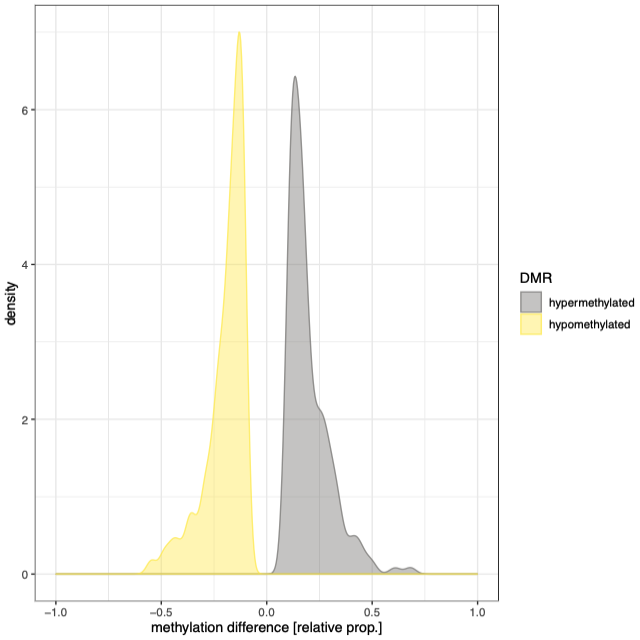
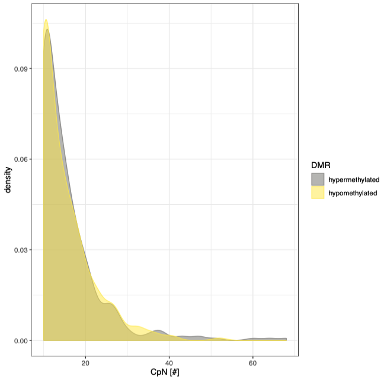

# EpiDiverse-DMR Output
This document describes the output produced by the pipeline.

## Pipeline overview
The pipeline is built using [Nextflow](https://www.nextflow.io/) and processes data using the following steps:

* [bedtools unionbedg](#bedtools-unionbedg) - compiling pairwise comparisons between groups
* [metilene](#metilene) - calling differentially methylated positions/regions
* [Visualisation](#visualisation) - distributions and heatmaps
* [Pipeline Info](#pipeline-info) - reports from nextflow about the pipeline run

### Output Directory Structure


## bedtools unionbedg
The first step of the pipeline is to identify which samples belong to the different groups according the "samples.tsv" file, and produce input files for *each pairwise comparison* between the specified groups by combining the appropriate samples together using [bedtools unionbedg](https://github.com/arq5x/bedtools2).

**Output directory: `dmrs/{CpG,CHG,CHH}/input/`**

* eg. `groupA_vs_groupB.bed`
  * There will be one file according to this naming convention for *each pairwise comparison* according to the number of groups that have been identified in the "samples.tsv" file.
  * The number of columns correspond to the total number of samples in the groups, giving the relevant methylation information (proportion) on each row.

Example `groupA_vs_groupB.bed` file:
```bash
chr         pos         groupA_rep1     groupA_rep2     groupB_rep1
Chr1        109         1.00            0.00            0.57
Chr1        110         1.00            0.00            0.00
Chr1        115         1.00            0.00            1.00
Chr1        116         0.95            0.85            1.00
Chr1        161         0.72            0.77            0.88
Chr1        162         0.80            0.90            1.00
Chr1        310         0.00            0.33            0.57
Chr1        311         0.00            0.75            0.78
...
```

## metilene
DMP/DMR calling is carried out using [metilene](https://www.bioinf.uni-leipzig.de/Software/metilene), using the input generated from bedtools unionbedg in the previous step.

**Output directory: `dmrs/{CpG,CHG,CHH}/metilene/`**

> For each type of output here there will be one file following the naming convention for *each pairwise comparison* according to the number of groups that have been identified in the "samples.tsv" file. The FIRST group in the name is considered the "control" or "comparison" group and eg. methylation difference is given _relative_ to this group.

* eg. `groupA_vs_groupB/groupA_vs_groupB.log`
  * Log file for each pairwise comparison performed by metilene
* eg. `groupA_vs_groupB/groupA_vs_groupB.bed`
  * The raw, unfiltered output from metilene. This contains all identified DMP/DMRs even if they fall outside the given q-value significance threshold (default 0.05). Check the [metilene documentation](https://www.bioinf.uni-leipzig.de/Software/metilene/Manual/#10_output) to understand this format.
* eg. `groupA_vs_groupB/groupA_vs_groupB.0.05.bed`
  * The is file contains the streamlined output from metilene which is filtered according to the parameters set for the pipeline run. This output is used for all downstream analysis and visualisation.

Example `groupA_vs_groupB.0.05.bed` file:
```bash
#chr        start       end         CpN     meth. diff.     significance    length

Chr1        433046      433090      10      -0.791500       0.027401        44
Chr1        656192      656381      10      -0.798500       0.039691        189
Chr1        670553      670943      15      -0.615333       0.034995        390
Chr1        1092268     1092338     12      -0.705000       0.009411        70
Chr1        1344363     1344554     15      -0.559333       0.0022926       191
Chr1        1581203     1581283     12      -0.684167       0.040138        80
Chr1        1593081     1593265     17      -0.660294       0.0047519       184
Chr1        1884168     1884365     13      -0.620385       0.013316        197
...
```

## Visualisation
The pipeline will generate heatmaps and density distribution plots for the DMP/DMRs generated for each pairwise comparison using R packages [gplots]() and [ggplot2]().

**Output directory: `dmrs/{CpG,CHG,CHH}/visual/`**

> For each type of output here there will be one file following the naming convention for *each pairwise comparison* according to the number of groups that have been identified in the "samples.tsv" file. The FIRST group in the name is considered the "control" or "comparison" group and eg. methylation difference is given _relative_ to this group.

* eg. `groupA_vs_groupB/groupA_vs_groupB.0.05.avg`
  * Raw input used to generate heatmaps, consisting of the average methylation level for each region for each individual sample used to derive the given pairwise comparison.
* eg. `groupA_vs_groupB/groupA_vs_groupB.0.05.txt`
  * Raw input used to generate density distribution plots consisting of CpN content, length, and methylation difference information for hyper- and hypo-methylated regions.

### Methylation heatmaps


* eg. `groupA_vs_groupB/groupA_vs_groupB.0.05_Heatmap.pdf`
  * A heatmap showing the relative methylation differences between samples.

### Distributions
#### Methylation difference


* eg. `groupA_vs_groupB/groupA_vs_groupB.0.05_DensDiff.pdf`
  * A plot showing the distribution of methylation differences among hyper- and hypo-methylated regions.

#### DMR lengths


* eg. `groupA_vs_groupB/groupA_vs_groupB.0.05_DensLen.pdf`
  * A plot showing the distribution of lengths among hyper- and hypo-methylated regions.

#### CpN content


* eg. `groupA_vs_groupB/groupA_vs_groupB.0.05_DensCpN.pdf`
  * A plot showing the distribution of CpN contents among hyper- and hypo-methylated regions.

#### Hyper- vs hypo-methylation counts


* eg. `groupA_vs_groupB/groupA_vs_groupB.0.05_Piechart.pdf`
  * A simple piechart showing the number of hyper- and hypo-methylated regions.

## Pipeline Info
Nextflow has several built-in reporting tools that give information about the pipeline run.

**Output directory: `dmrs/`**

* `dag.svg`
  * DAG graph giving a diagrammatic view of the pipeline run.
  * NB: If [Graphviz](http://www.graphviz.org/) was not installed when running the pipeline, this file will be in [DOT format](http://www.graphviz.org/content/dot-language) instead of SVG.
* `report.html`
  * Nextflow report describing parameters, computational resource usage and task bash commands used.
* `timeline.html`
  * A waterfall timeline plot showing the running times of the workflow tasks.
* `trace.txt`
  * A text file with machine-readable statistics about every task executed in the pipeline.