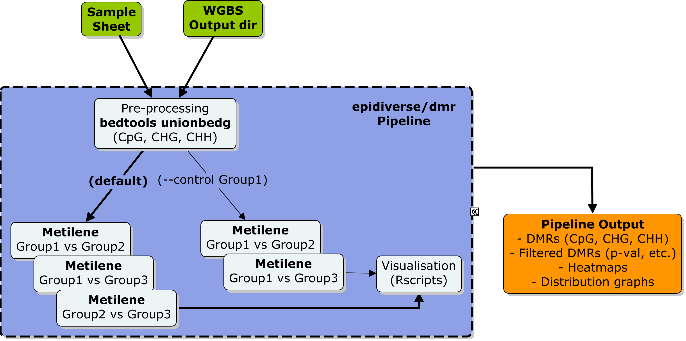

# EpiDiverse-DMR Usage
This document describes the parameter options used by the pipeline.

* [Running the pipeline](#running-the-pipeline)
* [Inputs and outputs](#inputs-and-outputs)
    * [`--input`](#--input-arg-required)
    * [`--samples`](#--samples-arg-required)
    * [`--output`](#--output-arg)
    * [`--control`](#--control-arg)
    * [`--dmp`](#--dmp)
* [DMR/DMP Calling](#dmr-dmp-calling)
    * [`--segSize`](#--segsize-arg)
    * [`--segContext`](#--segcontext-arg)
* [Additional parameters](#additional-parameters)
    * [`--noCpG`](#--noCpG)
    * [`--noCHG`](#--noCHG)
    * [`--noCHH`](#--noCHH)
    * [`--debug`](#--debug)
    * [`--version`](#--version)
    * [`--help`](#--help)
* [Software dependencies](#software-dependencies)
    * [`-profile`](#-profile)
    * [`-with-conda`](#-with-conda)
    * [`-with-docker`](#-with-docker)
    * [`-with-singularity`](#-with-singularity)
* [Other command line parameters](#other-command-line-parameters)
    * [`-work-dir`](#-work-dir)
    * [`-params-file`](#-params-file)
    * [`-config`](#-config)
    * [`-resume`](#-resume)
    * [`-name`](#-name)

## Workflow



## Running the pipeline
The main command for running the pipeline is as follows:

```bash
nextflow run epidiverse/dmr [OPTIONS]
```

Note that the pipeline will create files in your working directory:

```bash
work/           # Directory containing the nextflow working files
dmrs/           # Finished results (configurable, see below)
.nextflow.log   # Log file from Nextflow
.nextflow/      # Nextflow cache and history information
```

## Inputs and Outputs

### `--input <ARG>` [REQUIRED]
Specify the path to the directory containing each sample output from the [EpiDiverse/wgbs](https://github.com/epidiverse/wgbs) pipeline to be taken forward for analysis. All the sub-directories must correspond to sample names in the file provided to the `--samples` parameter, and contain within each one a bedGraph directory with files in '*.bedGraph' format. From the wgbs pipeline only the bedGraphs are necessary for this pipeline to run. For more information, please refer to the [EpiDiverse/wgbs documentation](https://github.com/EpiDiverse/wgbs/blob/master/docs/output.md) to view the relevant directory structure.

### `--samples <ARG>` [REQUIRED]
Specify the path to the "samples.tsv" file, containing information regarding sample names and corresponding groupings/replicates to determine how samples in the input directory should be analysed. The file must contain three *tab-delimited* columns: 1) sample names, corresponding to the sub-directories in the `--input` directory. 2) group names, for grouping sample replicates together. 3) replicate names to provide easy-to-read alternatives for complicated sample names.

Example "samples.tsv" file:

    sampleA_1    groupA    rep1
    sampleA_2    groupA    rep2
    sampleB_1    groupB    rep1

NB: Samples present in the `--input` directory will be ignored if not specified in the "samples.tsv" file.

### `--output <ARG>`
A string that will be used as the name for the output results directory, which will be generated in the working directory. This directory will contain sub-directories for each set of reads analysed during the pipeline. [default: dmrs]

### `--control <ARG>`
Specify a string that corresponds to a *group name* in the provided "samples.tsv" file, and the pipeline will run DMR comparisons for each group relative to this group. Otherwise, the pipeline will run all possible pairwise comparisons between groups if no control group is specified. [default: off]

### `--dmp`
Specify that DMPs should be analysed instead of DMRs. [default: off]

## DMR/DMP Calling
All options in this section are relevant to DMR calling, while only some are also applicable to DMP calling.

`--cov <ARG>`

Specify the minimum coverage threshold to filter methylated positions _before_ running the analyses. [default: 5]

`--sig <ARG>`

Specify the maximum q-value threshold for filtering DMP/DMRs post-analysis. [default: 0.05]

`--diff <ARG>`

Specify the minimum differential methylation level (percent) for filtering DMP/DMRs post-analysis. [default: 10]

`--CpN <ARG>`

Minimum number of Cs a DMR needs to contain in order to be reported. Not relevant to DMPs. [default: 10]
              
`--gap <ARG>`

Minimum distance (bp) between Cs that are not to be considered as part of the same DMR. Not relevant to DMPs. [default: 146]
              
`--resample <ARG>`

Minimum proportion of group samples that must be present in a given position in order to resample missing data [default: 0.8]

`--bonferroni`

Specify Bonferroni method for multiple comparison testing, otherwise Benjamini-Hochberg FDR will be used by default. [default: off]

### `--segSize <ARG>`
Give a hard cutoff for pre-segmenting regions prior to DMR identification. Higher values improve runtimes in CHG and CHH context but limit the capacity to identify DMRs that overlap the cutoff location. Can be turned off with 0. [default: 1000]

### `--segContext <ARG>`
Give a comma-delimited string of methylation contexts where you wish to apply the  heuristic `--segSize` parameter. [default: CHH]

## Additional Parameters

### `--noCpG`
Do not call DMP/DMRs in CpG context. Note: at least one methylation context is required for analysis. [default: off]

### `--noCHG`
Do not call DMP/DMRs in CHG context. Note: at least one methylation context is required for analysis. [default: off]

### `--noCHH`
Do not call DMP/DMRs in CHH context. Note: at least one methylation context is required for analysis. [default: off]

### `--debug`
Specify in order to prevent Nextflow from clearing the work dir cache following a successful pipeline completion. [default: off]

### `--version`
When called with `nextflow run epidiverse/dmr --version` this will display the pipeline version and quit.

### `--help`
When called with `nextflow run epidiverse/dmr --help` this will display the parameter options and quit.

## Software Dependencies

There are different ways to provide the required software dependencies for the pipeline. The recommended method is to use the Conda, Docker or Singularity profiles as provided by the pipeline. 

### `-profile`
Use this parameter to choose a preset configuration profile. See the [installation documentation](https://app.gitbook.com/@epidiverse/s/project/epidiverse-pipelines/installation) for more information about profiles.

Profiles available with the pipeline are:

* `standard`
    * The default profile, used if `-profile` is not specified.
    * Uses sensible resource allocation for , runs using the `local` executor (native system calls) and expects all software to be installed and available on the `$PATH`.
    * This profile is mainly designed to be used as a starting point for other configurations and is inherited by most of the other profiles below.
* `conda`
    * Builds a conda environment from the environment.yml file provided by the pipeline
    * Requires conda to be installed on your system.
* `docker`
    * Launches a docker image pulled from epidiverse/dmr
    * Requires docker to be installed on your system. 
* `singularity`
    * Launches a singularity image pulled from epidiverse/dmr
    * Requires singularity to be installed on your system.
* `epi|diverse`
    * Designed to be used on the [EpiDiverse](http://epidiverse.eu/) clusters `epi` or `diverse`
    * Launches jobs using the `SLURM` executor.
    * Uses pre-built conda environments to provide all software requirements.
* `custom`
    * No configuration at all. Useful if you want to build your own config from scratch and want to avoid loading in the default `base` config for process resource allocation.

If you wish to provide your own package containers it is possible to do so by setting the `standard` or `custom` profile, and then providing your custom package with the command line flags below. These are not required with the the other profiles.

### `-with-conda <ARG>`
Flag to enable conda. You can provide either a pre-built environment or a *.yaml file.

### `-with-docker <ARG>`
Flag to enable docker. The image will automatically be pulled from Dockerhub.

### `-with-singularity <ARG>`
Flag to enable use of singularity. The image will automatically be pulled from the internet. If running offline, follow the option with the full path to the image file.

## Other command line parameters

### `-work-dir <ARG>`
Specify the path to a custom work directory for the pipeline to run with (eg. on a scratch directory)

### `-params-file <ARG>`
Provide a file with specified parameters to avoid typing them out on the command line. This is useful for carrying out repeated analyses. A template params file [`assets/params.txt`](../assets/params.txt) has been made available in the pipeline repository.

### `-config <ARG>`
Provide a custom config file for adapting the pipeline to run on your own computing infrastructure. A template config file [`assets/custom.config`](../assets/custom.config) has been made available in the pipeline repository. This file can be used as a boilerplate for building your own custom config.

### `-resume [<ARG>]`
Specify this when restarting a pipeline. Nextflow will used cached results from any pipeline steps where the inputs are the same, continuing from where it got to previously. Give a specific pipeline name as an argument to resume it, otherwise Nextflow will resume the most recent. NOTE: This will not work if the specified run finished successfully and the cache was automatically cleared. (see: [`--debug`](#--debug))

### `-name <ARG>`
Name for the pipeline run. If not specified, Nextflow will automatically generate a random mnemonic.
